# Assignments for the first week

The TEI files for the assignments are available in [data/dodis](../data/dodis). If you are working on your own instance of TEI Publisher, upload the documents into the *Playground* collection.

Screenshots and XML examples below are taken from [data/dodis/49550.xml](../data/dodis/49550.xml). To compare, use this document as basis for your work.

The initial state of the document will look as in  the following screenshot:

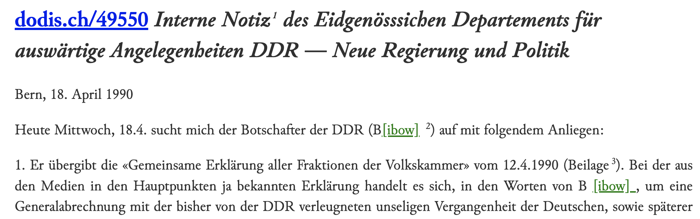

Every assignment includes a screenshot at the end, which shows how the desired output might look like. Of course you're free to style things differently.

## 1. Simple renditions with `model`

### 1.1 Make `emph` to display in italic

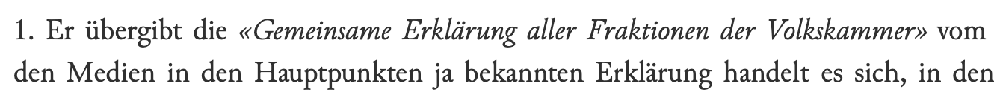

### 1.2 Render `persName` in color

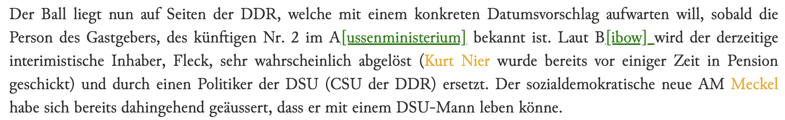

### 1.3 Move `dateline` to the right

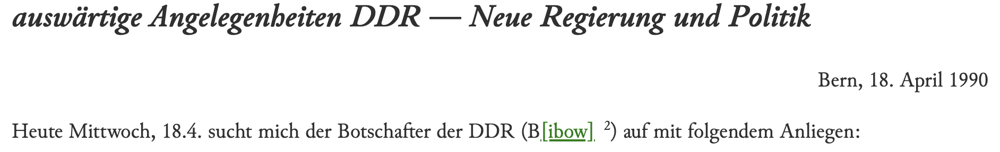

## 2. Using predicates

### 2.1 Format the main heading

The main heading is structured as follows:

```xml
<head>
    <ref target="http://dodis.ch/49550">dodis.ch/49550</ref>
    <title type="main">Interne Notiz des
        Eidgenösssichen Departements für auswärtige Angelegenheiten</title>
    <title type="sub">DDR — Neue Regierung und Politik</title>
</head>
```

We would like to show the titles as headings (using the `heading` behaviour). The second `title[@type="sub"]` should probably appear slightly different than the main heading.

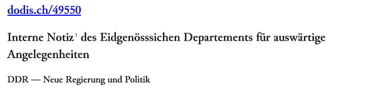

### 2.2 Make the `<ref>` link in the header less prominent

Decrease the font size to e.g. `19px` and show as right-aligned block. 

Hint: the HTML `<a>` element which is output by behaviour `link` is an inline element. To turn it into a block and make it right-aligned, you have to use some extra CSS:

```css
display: block;
text-align: right;
```

Note: we only want this to apply to `<ref>`s with a `parent::head`, not the refs appearing elsewhere inline in the text.

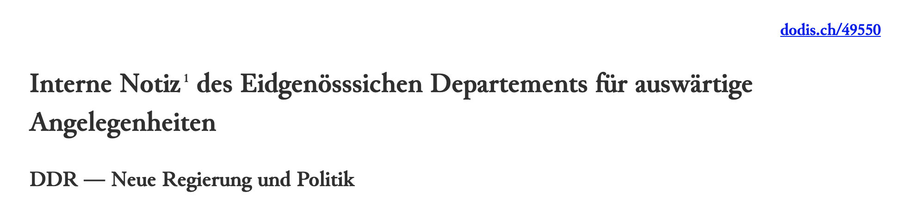

## 3. Passing parameters to behaviours

### 3.1 Show subtitle in smaller print

Building on 2.1: display `title[@type='sub']` in smaller print by setting the `level` of behaviour `heading` to 3, resulting in an `h3` to be output in the HTML.

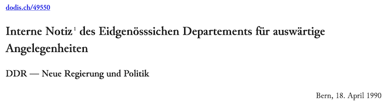

### 3.2 Format the date popover

When hovering over the date in the dateline, you will see that a tooltip is shown, displaying the regularised form of the date, in this case `1990-04-18`. This results from the fact that our ODD is chained to the *TEI Publisher Base* ODD which itself is linked to the *TEI Simple Print* ODD. The latter defines default models for elements belonging to the *TEI Simple Print* schema customisation and treatment of the `date` element is included there. While perfectly reasonable as a default choice, we might want to change the display a bit, for example showing it according to our own locale and preceding the date with the day of the week.

XPath language, which lies at the heart of the XML processing and, likewise, TEI PM, offers many functions for handling strings, dates etc. We could use the `format-date()` [see specification](https://www.w3.org/TR/xpath-functions-31/#func-format-date) function to achieve desired effect.

Change the `alternate` parameter for the correct `model` in the specs for `date`. Use `format-date` with a proper date template, e.g. `'[FNn], [D1o] [MNn] [Y]'`.

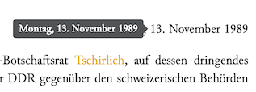

## 4. Integrating information from the TEI header

### 4.1 Display details about people

Most people occurring in the document are marked with  `persName`:

```xml
<persName ref="#P19511">Klaus Jacobi</persName>
```

The `@ref` points to a `person` record in the TEI header, which has additional information about the person:

```xml
<person xml:id="P19511">
    <persName>
        <forename>Klaus</forename>
        <surname>Jacobi</surname>
    </persName>
    <persName type="full">Jacobi, Klaus (1929–2004)</persName>
    <persName>Jacobi, Klaus Christoph</persName>
    <persName>Jacobi, Klaus</persName>
    <persName>JB</persName>
    <persName>Ja</persName>
    <persName>JK</persName>
    <persName>KJ</persName>
    <birth when="1929-11-12">
        <placeName>Biel/Bienne</placeName>
    </birth><person xml:id="P19511">
    <death when="2004-07-13">
        <placeName>Bern</placeName>
    </death>
    <sex>male</sex>
    <idno type="URI">https://dodis.ch/P19511</idno>
    <note>Staatssekretär des Departements für auswärtige Angelegenheiten 1989–1992</note>
</person>
```

We would thus like to show some of this information in a popover whenever the user moves the mouse over a `persName`.

* Change the spec for `persName` to use the `alternate` behaviour
* This behaviour takes two parameters: `default` and `alternate`
* Using XPath you can access the `<person>` record associated  with the `<persName>` in multiple ways, but the easiest is to use the `fn:id` function:

    ```xquery
    id(substring-after(@ref,  '#'), root(.))
    ```

    We have to  strip the leading '#' from the `@ref`. And `root(.)` gives us the document root node of the current document, thus indicating the context for the id lookup.

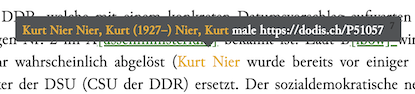

## 5. Using `modelSequence`

The popover created in 4.1 is shown, but the displayed content looks very messy as all the elements from the `person` record are output.

We thus have to define a spec for `person` and make sure to only output the elements we actually want to display to the user.

### 5.1 Limit output for `person` to the full name

* Create a spec for `person`
* As we want to output a specific sequence of items for each `person`, add a `modelSequence` to the spec
* Within the `modelSequence`, add a `model` to output `persName[@type='full']` as first item
* To select `persName[@type='full']`, set the `content` parameter of the model to point to this target element - otherwise we would again get the entire `person` record

### 5.2 Show the optional `note` about the person

Some `person` records have an additional `note` with a short description. We would like to see this next to the full name.

* Extend the created `modelSequence` to also output the note
* Caveat: if we just pass `note` to the content parameter, we  get a weird effect: the note is formatted as a footnote!

    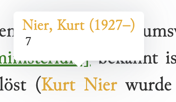

    This happens because processing will continue by calling the corresponding element spec for `note`, which by default outputs a footnote.

    We can fix this in two ways:

    1. make sure the processing skips the `note` element and pass in `note/node()`  for the `content` parameter
    2. or extend the element spec for `note` to have a special model for a `note` appearing within a `person`. In this case we want to apply behaviour `inline` instead of `note`

    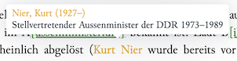

### 5.3 Add link to the Dodis record for the person

The `person` elements also have a link leading to an extended record: 

```xml
<idno type="URI">https://dodis.ch/P19511</idno>
```

We would like to output this as third item in our `modelSequence`.

* add another `model` to the `modelSequence` pointing to the `idno`
* create a spec for `idno` and use behaviour `link` to generate a link. It takes a `uri` parameter for the link target

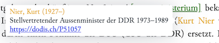

## 6. Showing Metadata from the teiHeader (Optional)

The `teiHeader` contains more information on the document, which might be interesting for readers. For example, a short summary of the text can  be found in the `msDesc`:

```xml
<sourceDesc>
    <msDesc>
        <msIdentifier>
            <idno>49548</idno>
        </msIdentifier>
        <head>DDR: Nicht nur die Mauer zittert</head>
        <msContents>
            <summary>Aufgrund der Bekanntgabe der neuen Reiseregelungen für DDR-Bürger wird mit DDR-Vertreter Tschierlich unter anderem über die künftige Visapraxis der Schweiz gegenüber der DDR diskutiert.</summary>
        </msContents>
        <history>
            <origin when="1989-11-13">13.11.1989</origin>
        </history>
    </msDesc>
</sourceDesc>
```

### 6.1 Output the summary on top

We'll later see how to display metadata in a separate sidebar. For now we just want to show it on top of the text. Note that the ODD will not receive the entire document - instead the document is split into chunks for viewing. By default, TEI Publisher splits the document on the division level, passing only single `div`  to the ODD. This has advantages for larger documents, which need to be paginated.

You can configure TEI Publisher to use a different chunk size, e.g. pages, the body or the entire document. But without changing anything in our example, the `div` will be the outermost element passed to our ODD.

We'll thus overwrite the elementSpec for `div` and add a `modelSequence` for the outermost `div[@type="doc"]`. Note that we want to remove the existing model with predicate `parent::body or parent::front or parent::back`, which would be applied by default, and  replace it with our own `modelSequence` to output

1. the summary
2. the `div` itself

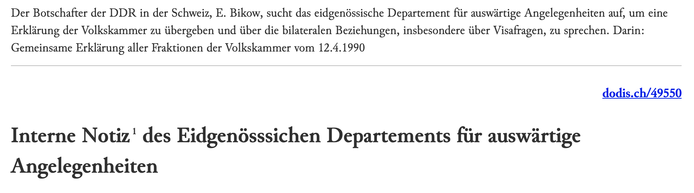
