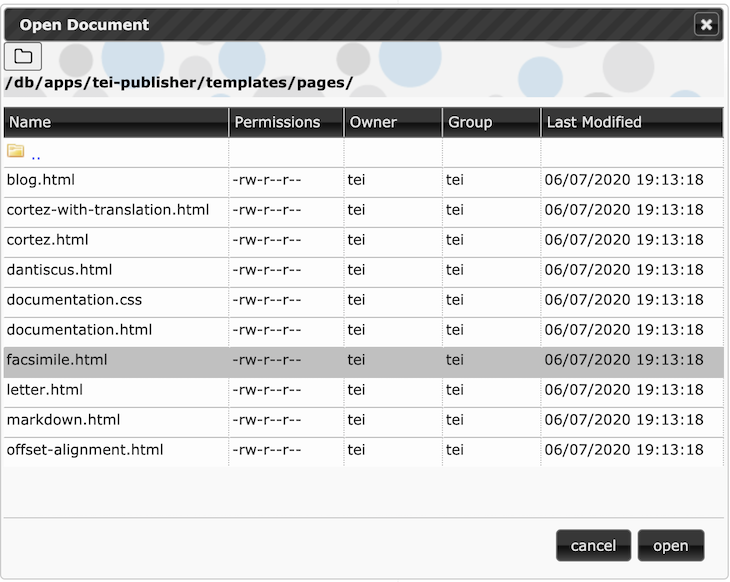
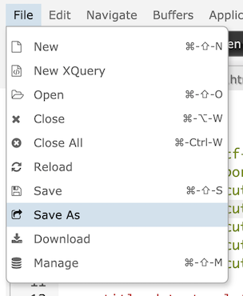
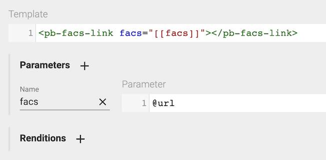
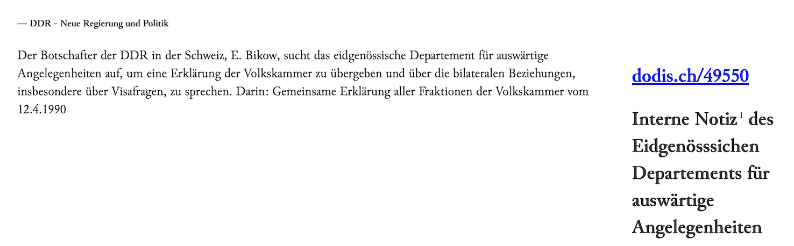
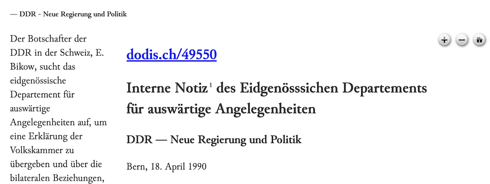

# Assignments for the second week

## 2.1 Showing a Facsimile

Create a new page template to integrate a facsimile:

1. go to the eXist dashboard and open *eXide*
2. log in as user `tei`, password `simple`
3. in eXide open the existing template: `/db/apps/tei-publisher/templates/pages/facsimile.html`

    

4. in the menu choose File/Save As and save the file with a new name

    

5. Change the `@content` attribute in line 13 to describe your new template:

    ```xml
    <meta name="description" content="Shakespeare Play"/>
    ```

6. In the TEI Publisher document view, choose your new template

The page should now be split into two areas with the text on the left and an image viewer to the right. Unfortunately the image viewer displays nothing so far. We first need to inform it about the facsimile images we want to be shown for a given document.

Within the Dodis TEI files, the facsimiles for a document are listed in the `<facsimile>` section following the TEI header:

```xml
<facsimile>
    <graphic url="49550-0.png"/>
    <graphic url="49550-1.png"/>
    <graphic url="49550-2.png"/>
</facsimile>
```

We thus need to pass this list of image names to the facsimile component. To do so in TEI Publisher, you output a custom HTML element (a web component) from within the ODD.

Note that the ODD will not receive the entire document - instead the document is split into chunks for viewing. By default, TEI Publisher splits the document on the division level, passing only single `div`  to the ODD. This has advantages for larger documents, which need to be paginated.

You can configure TEI Publisher to use a different chunk size, e.g. pages, the body or the entire document. But without changing anything in our example, the `div` will be the outermost element passed to our ODD.

We would thus want to output the list of facsimiles within the outermost `div[@type="doc"]`. Because we plan to output the list of facsimile images in addition to the div's content, we need a `modelSequence`, which

1. inserts a block with content taken from `root(.)//facsimile`
2. outputs the `div` itself

If you did A1 6.1, you will already have a `modelSequence` in place, so you just need to add another block at the start. Otherwise, you want to overwrite the elementSpec for `div` and add a `modelSequence` for the outermost `div[@type="doc"]`. Note that we want to remove the existing model with predicate `parent::body or parent::front or parent::back`, which would be applied by default, and replace it with our own `modelSequence`.

Next we have to output the actual facsimile links. Those won't be visible elements, so we can just ignore the `<facsimile>` wrapper element and create a spec to handle `<graphic>`.

Note that we would like to preserve the existing model in case we have other graphics elsewhere in the text. We thus add another model on top and limit it to `parent::facsimile` by defining a predicate.

For the link to the image we need a custom HTML element, which in the output should look as follows:

```xml
<pb-facs-link facs="49550-0.png"></pb-facs-link>
```

The easiest way to achieve this is to add a *template*. Templates are an extension to the processing model. They come handy whenever you have to output custom or more complex HTML, XML or text (e.g. LaTeX).



You can reference parameters inside a template by using double brackets as in `[[facs]]`. The bracketed string will be replace by the value of the parameter of the same name.

## 2.2 Output metadata in a separate column

We would like to output some of the metadata in a separate sidebar to the left of the text. Among other things, we would at least like to show the summary of the document, which is contained in the `msDesc` of the `teiHeader`. This was already explained in A1 6, but to recap, the XML fragment looks as below:

```xml
<sourceDesc>
    <msDesc>
        <msIdentifier>
            <idno>49548</idno>
        </msIdentifier>
        <head>DDR: Nicht nur die Mauer zittert</head>
        <msContents>
            <summary>Aufgrund der Bekanntgabe der neuen Reiseregelungen für DDR-Bürger wird mit DDR-Vertreter Tschierlich unter anderem über die künftige Visapraxis der Schweiz gegenüber der DDR diskutiert.</summary>
        </msContents>
        <history>
            <origin when="1989-11-13">13.11.1989</origin>
        </history>
    </msDesc>
</sourceDesc>
```

To show the summary in a separate column, we first need to extend our HTML template to include an additional `pb-view` *before* the main text view and the facsimile. We thus insert another `pb-view` and assign it the id `metadata`, which we can later use to style it:

```xml
<main class="content-body">
    <pb-view id="metadata" src="document1" xpath="//teiHeader" view="single"></pb-view>
    <pb-view id="view1" src="document1" column-separator=".tei-cb" append-footnotes="append-footnotes" subscribe="transcription" emit="transcription" wait-for="#facsimile"/>
    <pb-facsimile id="facsimile" base-uri="https://apps.existsolutions.com/cantaloupe/iiif/2/" default-zoom-level="0" show-navigation-control="show-navigation-control" show-navigator="show-navigator" subscribe="transcription"/>
</main>
```

As you can see, we use an XPath expression to target the header only. The `xpath` attribute is mostly used in combination with `view="single"` - which means we don't want automatic pagination to be applied.

In the ODD we now need a rule to handle `teiHeader`. Overwrite the last model which calls behaviour `metadata` (the `metadata` behaviour changes the HTML head only, so won't output anything). Instead, output a block with the content of `.//msDesc/msContents/summary`.

The page may now look as in the screenshot below:



Our sidebar is a bit wide now, leaving barely any room for the text itself. Fortunately we can easily change this with some CSS.

The horizontal placement of text and facsimile is achieved with a handy CSS3 feature called *Flexbox layout*. You can read everything about it by following [this link](https://css-tricks.com/snippets/css/a-guide-to-flexbox/). For now it's enough to know that the blocks within `.content-body` are arranged in columns, giving a certain amount of space to each of the columns in it. How much space each column gets depends on a number of factors, but you can prioritize columns by assigning them a lower or higher flex number. Add a rule to the CSS `<style>` in the `<head>` of your HTML template:

```css
#metadata {
    flex: 1 1;
}
```

The first number indicates the priority with which the element should benefit from more space being available, the second number how much it should shrink if space decreases. So just giving `#metadata` a `1 1` flex won't solve our issue - we also need to bump up the flex for the other two elements in the box to give them a larger portion of the available space:

```css
#view1 {
    flex: 3 1;
    height: var(--pb-view-height);
    overflow: auto;
}

.content-body pb-facsimile {
    flex: 3 1;
    height: var(--pb-view-height);
}
```

This should result in a resizing of the columns:



## 2.3 Display additional metadata

Beyond a summary, the teiHeader contains additional information which might be interesting to readers, e.g. keywords or the language of the source document.

Try to output some of this additional information. For the keywords, you may want to generate a list. Use the corresponding behaviours `list` and `listItem` for it.
