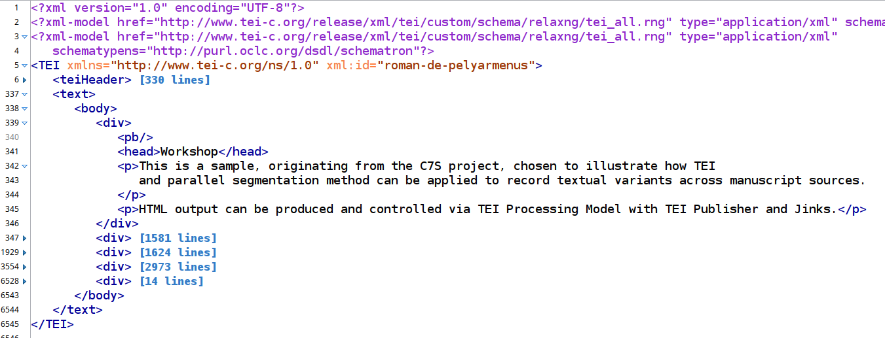

# Exercise: handling textual variants

## Data sample

We're gonna use a shortened sample from a project we have been working on, a web publication for the *Canoniser les Sept Sages de Rome* (C7S). We will use the first chapter of _Roman de Pelyarmenus_.

We have already created a XAR file that contains this file, see https://github.com/eeditiones/workshop/tree/master/data/pelyarmenus. Please familiarize yourself with the encoding structure of the document - structural divisions into chapters and paragraphs.

[Roman-de-pelyarmenus.xml](https://github.com/eeditiones/workshop/tree/master/data/pelyarmenus/Roman-de-Pelyarmenus.xml)

{width=1124 height=589}


## TEI encoding of textual variants in the XML source

C7S uses the parallel segmentation method, the recommended method for precise and fine-grained modelling of phrase-level variants across textual witnesses.

### Example: lemma and variant reading

```xml
    <app>
        <lem wit="#V2 #G #X2">metre a mort</lem>
        <rdg wit="#B">murtrir</rdg>
    </app>
```

### Example: reading omitting a fragment

```xml
(...)
    <persName key="Dyalogus">Dyalogus</persName>, 
    <app>
        <lem wit="#V2 #G #X2">son frere</lem>
        <rdg wit="#B"/>
    </app> 
    le bastart, (...)
```

### Example: other encoding nested in readings

```xml
    Ci 
    <app>
        <lem wit="#V2 #G #X2">fine li livres de 
            <persName key="Cassidorus">Cassydorus</persName>, 
            si parlerons aprés de 
            <persName key="Pelyarmenus">Pelyarmenus</persName> 
            de <placeName key="Rome">Romme</placeName> comment
            il avoit pourchacié vers
        </lem>
        <rdg wit="#B">vient li contes a</rdg>
    </app>
```

## Individual assignment 1

Have a look at the out-of-the-box rendition of the *Roman ...* sample in [TEI Publisher](https://teipublisher.com/exist/apps/tei-publisher/playground/Roman-de-Pelyarmenus.xml)

Identify the problems in default rendering and try to find the TEI encoding elements, for which processing would need to be altered.

## Group session

Discuss with the group regarding the order of priorities in addressing the problems.

Solve some *low hanging fruit* cases together (e.g. handling of page and column breaks).

## Individual assignment 2 - warmup

1. Create your own ODD, using your surname in the filename and the descriptive part, so you can easily find it later.
3. Display the Pelyarmenus file in the browser and select your customized ODD. At this point there will be no visual change.
2. Make a small rendition change to all apparatus entries, e.g. make it display in a distinct color or italicize (why not both?).
4. Refresh the displayed file and observe the change in rendition.

## Individual assignment 3 - using alternate

1. Working in your ODD, change your model for `app` to use the *alternate* behaviour to present the lemma in the reading text and variant readings in the tooltip

## Individual assignment 4 - witnesses

For a complete representation of the apparatus, we need to include information about witnesses attesting particular readings. This information is represented through the `@wit` attribute on the `rdg` element.

1. Create a model for the `rdg` element and modify the `content` parameter to include the witness sigla information.
2. To strip out unwanted `#` signs you can use XPath functions operating on text: similar effects can be achieved in different ways

## Group session - using custom templates for arbitrary structures

Creating a nested structure for reading text and witness information; special case for *empty* readings (phrases omitted in a particular witness)

```xml
<elementSpec ident="rdg" mode="add">
    <model behaviour="pass-through">
        <param name="witnesses" value="tokenize(@wit, ' ') ! substring(., 2)"/>
        <param name="content" value="if (normalize-space(.)) then . else 'om. '"/>
        <pb:template xmlns="" xml:space="preserve"><span class="app rdg">[[content]] <span class="app wit">[[witnesses]]</span></span></pb:template>
    </model>
</elementSpec>
```

```css
.app {
    font-style: italic;
}

.app.rdg {
    font-style: normal;
}

.app.wit {
    margin-left: 1rem;
    margin-right: 1rem;
    font-style: italic;
}
```

