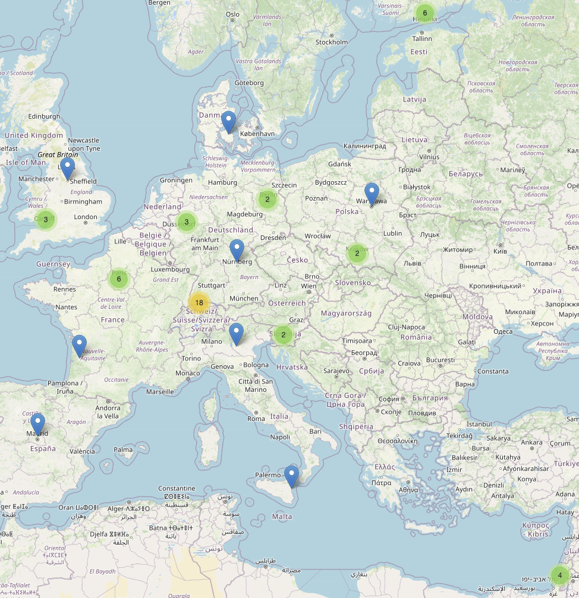
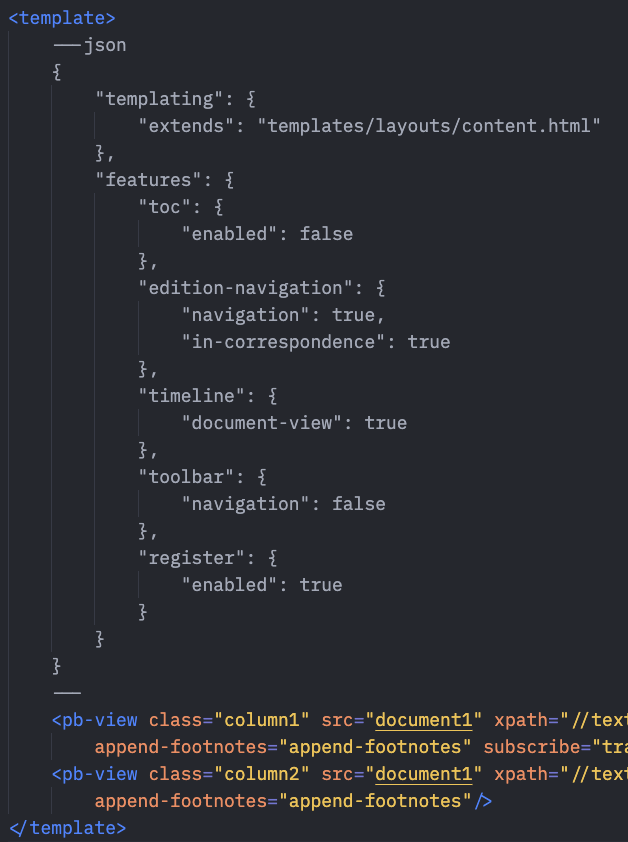
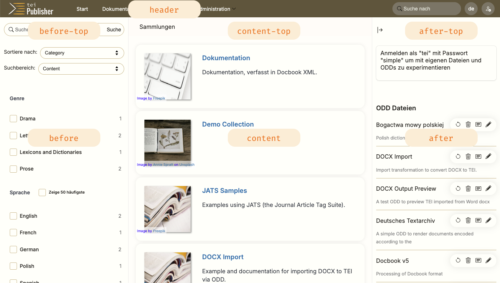
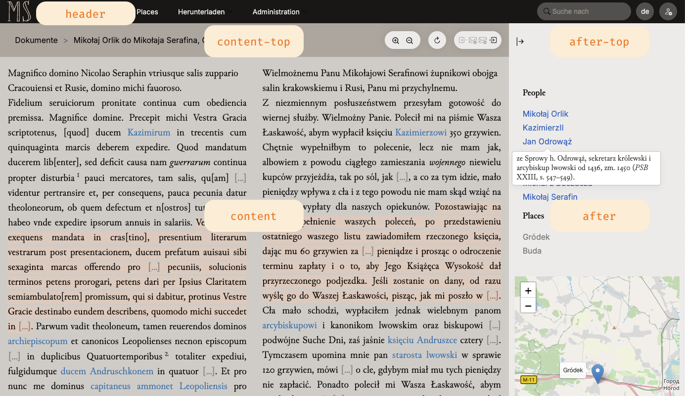

### Virtuelles DH-Kolloquium an der BBAW, 24.11.2025
# TEI-Publisher

## Wolfgang Meier

- e-editiones.org
- Heidelberger Akademie der Wissenschaften
- Jinntec GmbH
---
# TEI Publisher

- started in 2015 as a reference implementation of the TEI Processing Model
- evolved into a complete toolbox for publishing digital editions
- grassroots community effort coordinated by e-editiones

---

# Vision

- "one-size fits all" rarely works in the humanities 
- reusable, modular components to be rearranged and recombined
- sensible defaults where possible without limiting extensibility

---
# TEI Processing Model

- used for all textual transformations in TEI Publisher
- formalizes the description of transformation rules in TEI ODD
- officially part of the TEI Guidelines since 2016

---
# TEI Publisher 10

- extends the toolbox idea and moves it to the next level
- decomposes the core of TEI Publisher into a set of small, modular profiles, which can be customized and recombined to compose concrete applications
---
# Benefits

- for __editors__: many aspects covered by configuration plus TEI ODD, no coding required
- for __developers__: faster production of digital editions by reusing and customizing profiles; less copy and paste of code
- for __infrastructure providers__: provide tailored blueprints for an institution; clear update and maintenance path

---
# Profiles

- __Base__: a profile providing the core server-side API of TEI Publisher and basic page layout without styling
- __Feature__: a functional sub-profile. It adds specific functionality, e.g. docker configuration, IIIF viewer or a landing page
- __Theme__: provides styling for a particular look and feel. Without this, you only get very plain HTML website.
- __Blueprint__: a complete template for an application targeted at a specific use case like a monograph, correspondence edition, dictionary etc. It combines the base profile with a feature and theme selection and configuration.
---
- each profile covers a particular aspect
- it may depend on or extend other profiles
- all profiles and applications generated from them have the same organizational structure

---
# Jinks

- central application manager of TEI Publisher: composes profiles into applications
- the composition is controlled by a central configuration file to which each profile contributes its settings
- updates to upstream profiles can be applied automatically
- local changes are tracked to avoid overwriting by upstream changes
---
# Jinks Templates

- new templating library works for HTML as well as XQuery, Javascript, CSS …
- used statically to generate application code as well as dynamically for rendering HTML pages
---

- powerful template inheritance model: assemble simpler templates to build complex page layouts 
- frontmatter allows templates to adjust configuration settings, e.g. disable UI features
---
# Page Layout and Theming

- all styling is handled by theme profiles
- TEI Publisher base only provides an _abstract page layout_
- profiles may inject UI fragments into defined areas
---

# Styling

- common styling properties can be changed via configuration (rather than CSS)
- TP 10 drops Google Material Design and uses semantic HTML + pure CSS instead
- minimal use of CSS classes
- core webcomponents changed to use standard HTML, styleable from the application
---

# Refactored Base ODD

- all ODDs inherit from `teipublisher.odd`
- provides sensible defaults for most common TEI elements
- covers variant use case scenarios
- many documents will render satisfactorily out of the box
- limits the need for custom ODD rules

---
# More profiles to come …

- Rather than creating a complete custom application, projects can contribute the missing profiles they need
- Coming soon:
    - EDEp: an editor for epigraphic inscriptions, facilitating data entry and transcription
    - DTS: distributed text services API support
    - DTA (Deutsches Text Archiv): various profiles to display and enhance documents following the DTA guidelines
    - USWDS: a theme implementing the U.S. Web Design System

---
# e-editiones

- non-profit organization founded in 2020
- limited budget: membership fees only!
- development mainly cross-financed by the edition projects
- TEI Publisher 10 was primarily supported by

    
    
    

