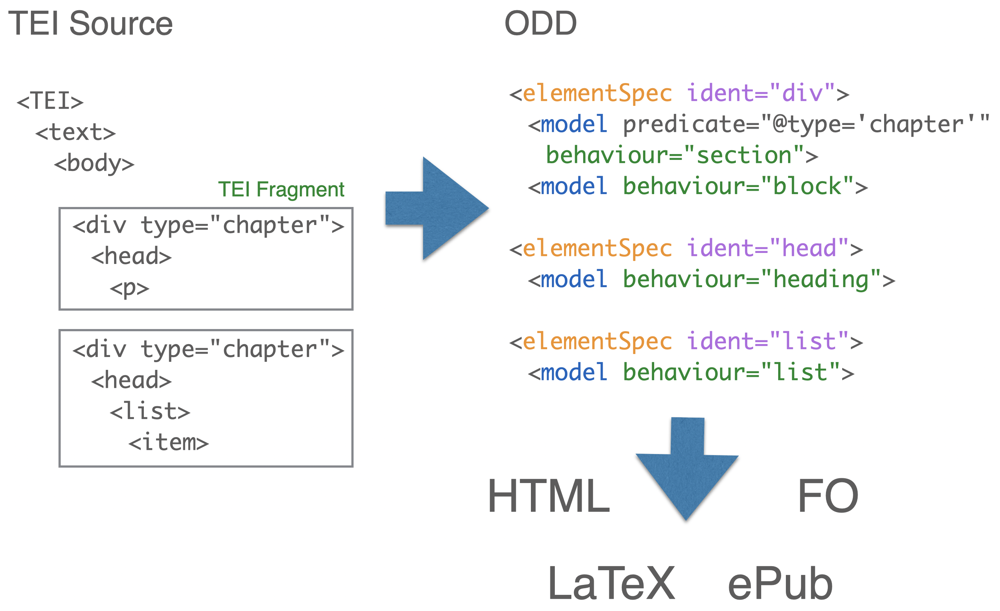
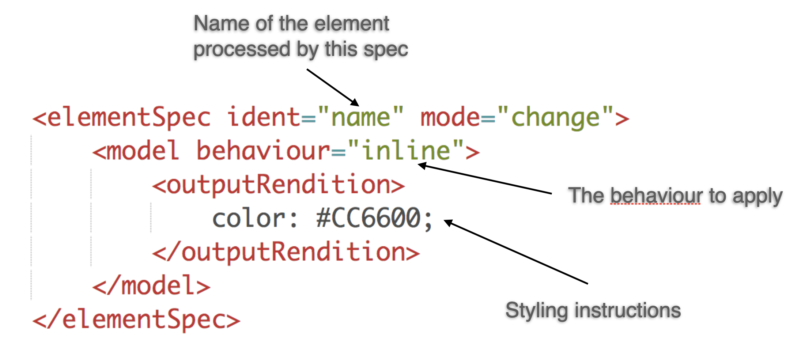
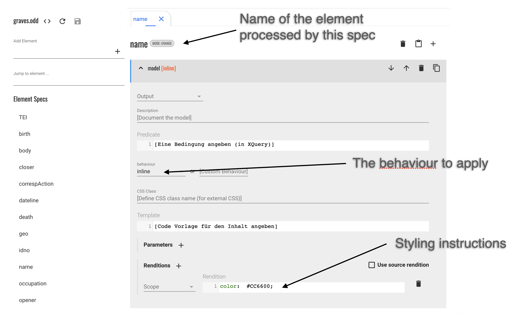
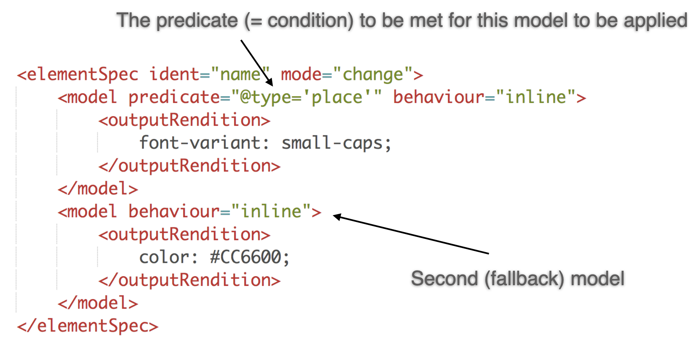

# TEI Publisher reloaded

## Digitale Editionen mit System – modular, nachhaltig, community-orientiert

+ Nils Berns
+ Andreas Christ
+ Richard Diebel
+ Lars Windauer
+ Wolfgang Meier

---
# TEI Publisher

- started in 2015 as a reference implementation of the TEI Processing Model
- evolved into a complete toolbox for publishing digital editions
- grassroots community effort coordinated by e-editiones

---

# Vision

- "one-size fits all" rarely works in the humanities 
- reusable, modular components to be rearranged and recombined
- sensible defaults where possible without limiting extensibility

---
# TEI Publisher 10

- extends the toolbox idea and moves it to the next level
- decomposes the core of TEI Publisher into a set of small, modular profiles, which can be customized and recombined to compose concrete applications
---
# Benefits

- for __editors__: many aspects covered by configuration plus TEI ODD, no coding required
- for __developers__: faster production of digital editions by reusing and customizing profiles; less copy and paste of code
- for __infrastructure providers__: provide tailored blueprints for an institution; clear update and maintenance path

---
# Profiles

- __Base__: a profile providing the core server-side API of TEI Publisher and basic page layout without styling
- __Feature__: a functional sub-profile. It adds specific functionality, e.g. docker configuration, IIIF viewer or a landing page
- __Theme__: provides styling for a particular look and feel. Without this, you only get very plain HTML website.
- __Blueprint__: a complete template for an application targeted at a specific use case like a monograph, correspondence edition, dictionary etc. It combines the base profile with a feature and theme selection and configuration.
---
- each profile covers a particular aspect
- it may depend on or extend other profiles
- all profiles and applications generated from them have the same organizational structure

---
# Jinks

- central application manager of TEI Publisher: composes profiles into applications
- the composition is controlled by a central configuration file to which each profile contributes its settings
- updates to upstream profiles can be applied automatically
- local changes are tracked to avoid overwriting by upstream changes
---
# TEI Processing Model

- used for all textual transformations in TEI Publisher
- formalizes the description of transformation rules in TEI ODD
- officially part of the TEI Guidelines since 2016

---
# Behaviours

+ abstract formatting actions
+ media-agnostic

---
# Traversing the TEI

- traverse TEI from top to bottom
- root: entire document or part
- check for elementSpec
- test additional constraints/conditions
- apply first model matching

---

---

---
# Defining the Look: Using CSS

+ to express styling, processing model uses CSS
+ `outputRendition`: CSS properties for the current model
+ describes editorial aspects, e.g. **bold**, _italic_, extra spacing or add [ ] to mark conjectures
+ general styling and typography should be defined outside the ODD

---
# Basic CSS

| Inline elements | Block elements |
|---|---|
| font-weight: bold; | margin: 10px 0; |
| text-decoration: underline; | padding: 10px 20px; |
| font-style: italic; | float: right \| left; |
| color: blue; | text-align: center \| justify \| right; |
| font-variant: small-caps; ||
| font-size: large \| larger \| small \| smaller; |

---
# Multiple Models

---
# Applying Models

+ Only the **first matching model** will be applied. Simple and predictable!
+ Matching means without any predicate or with a predicate for which its condition evaluates to true
+ __Nota bene__: Any following models will be ignored even if they match

---
# Predicates

+ In the `@predicate` attribute we establish the condition that must be met for that model to be applied
+ The value of `@predicate` is an XPath expression

__XPath__: expression language for XML

---
# XPath Primer

+ `epigraph/cit` – select epigraph child of context node, then cit child
+ `./epigraph/cit` – same as above. “.” selects context node
+ `parent::cit` – select parent node (it if is a cit)
+ `ref/@type="can"` – select ref child with attribute type = “can”
+ `ref/@type='can' and parent::cit` – boolean condition
+ `placeName[@type = 'full']` – select placeName matching condition @type=”full”
+ `number(substring(@xml:id, 2))` – applying functions to attribute xml:id
+ `'Hello ' || @target` – string concatenation

---
# Page Layout and Theming

- all styling is handled by theme profiles
- TEI Publisher base only provides an _abstract page layout_
- profiles may inject UI fragments into defined areas

---
# e-editiones

- non-profit organization founded in 2020
- limited budget: membership fees only!
- development mainly cross-financed by the edition projects
- TEI Publisher 10 was primarily supported by

    
    
    

